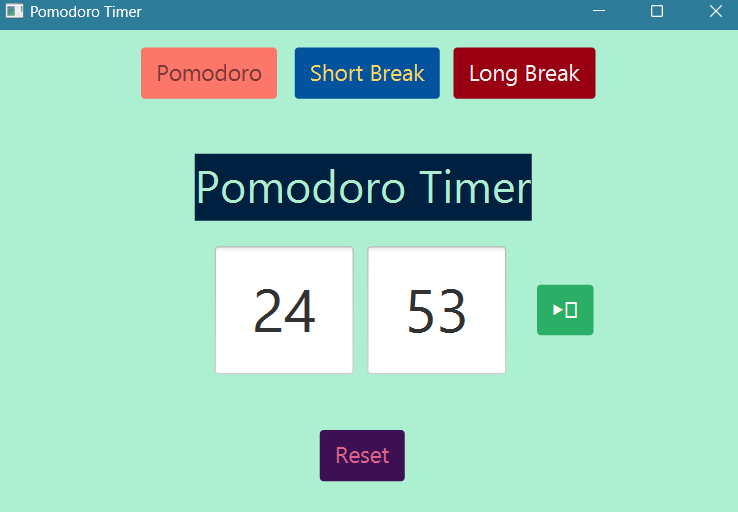

# Pomodoro Timer App

Welcome to the Pomodoro Timer App! This application is designed to enhance productivity by implementing the Pomodoro Technique, a time management method that promotes focused work sessions interspersed with short breaks.

## Features

- **Pause Anytime**: Start or pause your work session with a simple click and halt the timer at any moment if you need to step away.
- **Auto-Activation**: The timer automatically starts the next session, ensuring smooth transitions between work and break periods.
- **Short Breaks**: After each work session, enjoy a short break to recharge.
- **Long Breaks**: Take a longer break after a set number of work sessions to maintain productivity.
- **Timer Switching**: Easily switch between work and break timers to adapt to your workflow. 

## How to Use

1. **Start/Pause**: Click the play/pause button to begin your work session. The timer will automatically start a break period once the work session ends.
2. **Short Breaks**: After each work session, a short break is automatically activated to give you a quick rest.
3. **Long Breaks**: After completing a set number of work sessions (usually 4), a long break is activated to help you relax more thoroughly.
4. **Switch Timers**: You can manually switch between work and break timers as needed for a flexible and uninterrupted workflow.

## Who Can Benefit?

This Pomodoro Timer App is perfect for:

- **Students**: Enhance your study sessions with structured work and break times.
- **Working Professionals**: Boost your productivity during work hours by managing your time effectively.
- **Anyone**: Whether you're working on a project, learning a new skill, or tackling a task, the Pomodoro Timer App can help you stay focused and efficient.

## Installation

To get started, follow these steps:

1. **Clone the Repository**:
   ```bash
   https://github.com/aaakloo-waiting/Pomodoro_Timer.git
2. **Install JavaFx**
   You may use any IDE(IntelliJ IDEA or Eclipse) to setup Java environment(Download all required external libraries for Javafx). No Database connection needed.
3. **Setup JDK**
   From the "Project Structure", make sure to add oracle openJDK(version 21 or higher preferable) as dependency and load the gui project. Compile and Run it at the backend of your othe programs and enjoy your productive session!


## Screenshot

<div style="display: flex; justify-content: center; align-items: flex-start; gap: 20px;">
  <div style="text-align: center;">
    
    <br/>
    <em>Smart Pomodoro Timer</em>
  </div>
</div>

